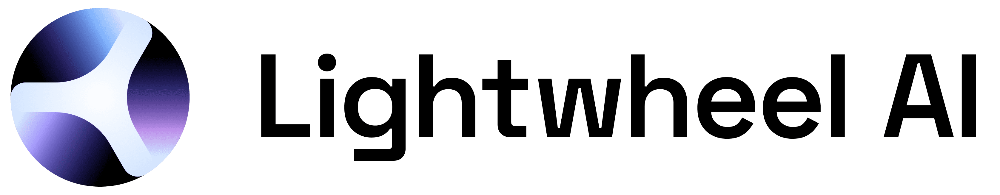
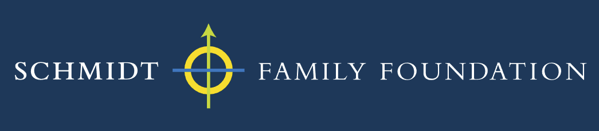

# 🏆 **2025 BEHAVIOR Challenge**

**Join us and solve 50 full-length household tasks in the realistic BEHAVIOR-1K environment, with 10,000 teleoperated expert demonstrations (1200+ hours) available!** 🤖

---

## :material-video: **Challenge Walkthrough**

[Challenge Video Placeholder - Main walkthrough video for participants]

## :material-graph-outline: **Overview**

**BEHAVIOR** is a robotics challenge for everyday household tasks. It's a large-scale, human-grounded benchmark that tests a robot's capability in high-level reasoning, long-range locomotion, and dexterous bimanual manipulation in house-scale scenes.

This year's challenge features:

- **50 full-length household tasks** from our 1,000 activity collection
- **10,000 teleoperated demonstrations** (1200+ hours) for training

=== ":material-format-list-checks: Tasks"

    The challenge tasks span diverse everyday activities:

    - **Rearrangement** - Organizing and tidying spaces
    - **Cooking** - Food preparation and cooking processes
    - **Cleaning** - Wiping surfaces, mopping floors, and using washers
    - **Installation** - Hanging pictures, installing fixtures

    [Learn more about tasks →](../behavior_components/behavior_tasks.md)

=== ":material-robot: Simulator"

    Powered by NVIDIA Omniverse, supporting:

    - Rigid body and soft body physics
    - Semantic object states and interactions
    - High-fidelity rendering and sensors
    - Fluid and particle systems  

    [Simulator details →](../omnigibson/overview.md)

=== ":material-home: Scenes"

    - House-scale layouts with multiple rooms
    - Fully interactive objects with realistic physics
    - Rich semantic and physical properties
    - Dynamic state changes (temperature, cleanliness, etc.)

    [Explore scenes →](../omnigibson/scenes.md)

## :material-database: **Dataset & Baselines**

### Teleoperated Demonstrations

**10,000 expert demonstrations** (1200+ hours) collected via teleoperation:

- Synchronized RGBD observations
- Object and part-level segmentation
- Ground-truth object states
- Robot proprioception and actions
- Skill and subtask annotations

[Dataset details →](./dataset.md)

### Baseline Methods

Pre-implemented training & evaluation pipelines for:

- **Behavioral Cloning baselines**: ACT, Diffusion Policy, BC-RNN, WB-VIMA - these are diverse imitation learning approaches that learn from the provided demonstrations.
- **Pre-trained Visuo-Language Action models**: OpenVLA and π0.  These models are pretrained by a large amount of demonstration data, giving an alternative to models that need to be trained from scratch.

[Baseline details →](./baselines.md)

## :material-chart-box: **Evaluation & Rules**

### Challenge Tracks

**Standard track:** Limited to provided robot onboard observations (RGB + depth + instance segmentation + proprioception).

**Privileged information track:** May query simulator for any information (object poses, scene point clouds, etc.).

🏆 **Prizes per track:** 🥇 $1,000 | 🥈 $500 | 🥉 $300

Top 3 teams from each track will be invited to present at the workshop!

[Full challenge rules →](./rules.md)

### Evaluation Metrics

**Primary metric (for ranking):** Task success rate averaged across 50 tasks. Partial credit given as fraction of satisfied BDDL goal predicates.

**Secondary metrics (efficiency):**

- **Simulated time** - Total simulation steps × time per step
- **Kinematic disarrangement** - Cumulative object displacement 
- **Distance navigated** - Total base movement distance
- **Hand displacement** - Cumulative hand movement

[Evaluation details →](./tutorials/policy_eval.md)

## :octicons-person-add-16: **Participating**

### Resources

- [Discord community](https://discord.gg/bccR5vGFEx)
- [Challenge office hours](#) (TBD)

### Important Dates

- **Challenge Launch**: September 2, 2025
- **Submission Deadline**: November 15, 2025
- **Winners Announcement**: December 6-7, 2025 @ NeurIPS conference in San Diego

To encourage participation, we’ve secured prizes for the winners: $1,000 for 1st place, $500 for 2nd, and $300 for 3rd place (along with, of course, the opportunity to publish your methods in the proceedings!). The real reward is contributing to the advance of embodied AI - and perhaps claiming the title of the robot that best “behaves” in a virtual home.

## :material-handshake: **Sponsors**

We gratefully acknowledge the support of our sponsors who make this challenge possible:

  
  
  
  

